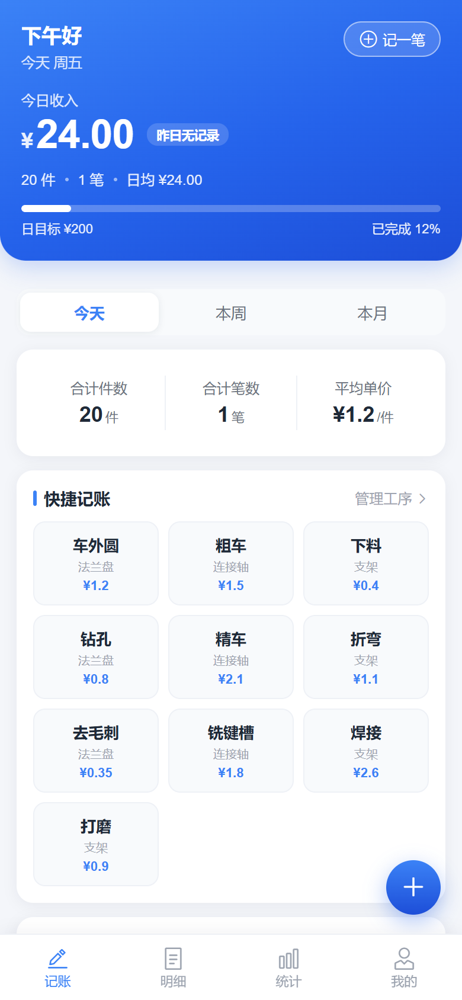
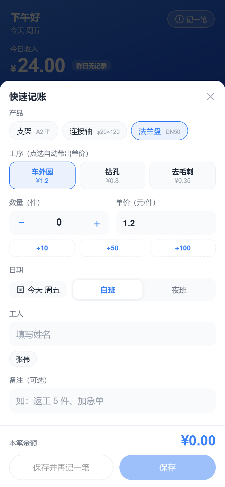
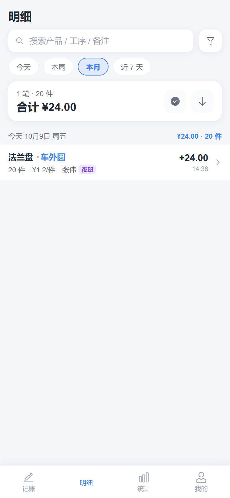
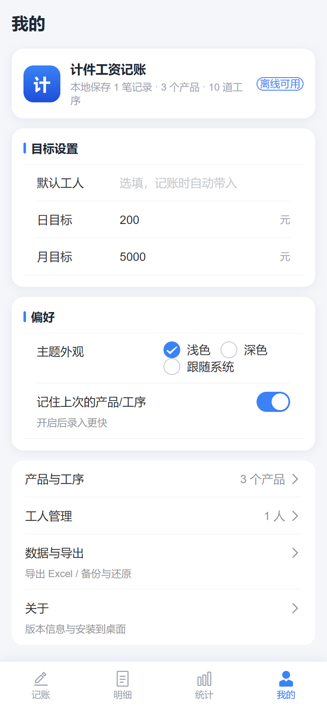

# Piece-Rate Wage Bookkeeping · Android App

[中文版请看](README.md) / [README.md](README.md).

A **local bookkeeping Android app** for piece-rate work in workshops and factories:
install the APK and it is ready to use. **No network, no login, and all data stays on the
device** (in-app IndexedDB), so it keeps working offline.

> Scope: quick entry, filterable records, multi-dimensional charts and statistics, one-click
> Excel/CSV export, local backup and restore, light and dark themes.
>
> **Name notice**: this project is an independently developed, open-source third-party tool and has
> **no affiliation of any kind** with Shanghai Huixian Network Technology Co., Ltd. or its
> "Anxin Jijian" product; there is no cooperation, licensing, corporate or other relationship between
> them. The name "Anxin Jijian" is mentioned here only as a functional reference point alongside
> similar mobile piece-rate bookkeeping tools, and implies no comparison or judgement about the
> quality of either product.

> **Before you start**: all data is stored in the app sandbox on this device. **Uninstalling the
> app or clearing its data will lose everything.** Please export `.json` backups regularly via
> "Mine → Data & Export → Export Backup". The backup format is compatible with the web version
> (PWA), so a backup exported from either side can be imported into the other.

## Installation

Download the latest `app-debug.apk` from the [Releases](https://github.com/wdre9/jijian-app/releases)
page, transfer it to your phone, and tap to install. Android will warn about "unknown sources"
the first time; allow the installation for this app (the exact menu varies by brand:
Settings → Security / More settings → Install unknown apps).

## Screenshots

Screenshots below are from the actual running app.

| Home | Quick Entry |
| --- | --- |
|  |  |
| Today / week / month totals and recent records | Product, process, quantity and auto-filled unit price |

| Records | Statistics |
| --- | --- |
|  |  |
| Multi-condition filtering and bulk export | Income trend, product share and income ranking |

| Products & Processes | Data & Export |
| --- | --- |
|  |  |
| Product, process and unit price management | Excel / CSV / backup JSON import & export |

| Mine |
| --- |
|  |
| Theme switching, default worker and preferences |

---

## 1. Tech Stack

| Category | Choice |
| --- | --- |
| App shell | Capacitor 6 (Android WebView, `appId=com.wdre9.jijian`) |
| Build | Vite 5 |
| Framework | Vue 3 (`<script setup>` + TypeScript) |
| Router | Vue Router 4 (Hash mode, no server config needed) |
| UI | Vant 4 (mobile component library) |
| State | Pinia |
| Local storage | localForage (IndexedDB, with fallback) |
| Charts | ECharts 5 + vue-echarts (on-demand registration) |
| Export | xlsx (Excel), native Blob (CSV/JSON), html2canvas (statistic long image) |
| OCR import | tesseract.js (on-device recognition, image text never leaves the device) |
| Packaging | Android Gradle Plugin 8.2.1 / Gradle 8.2.1, minSdk 22 / compileSdk 34 |

---

## 2. Project Structure

```
jijian-app/
├─ android/                    # Capacitor-generated Android project
│  ├─ app/                     # App module (build.gradle, AndroidManifest, MainActivity)
│  ├─ gradle/wrapper/          # Gradle Wrapper
│  ├─ gradlew / gradlew.bat    # Linux / Windows build scripts
│  ├─ build.gradle / settings.gradle / variables.gradle
│  └─ capacitor.settings.gradle
├─ .github/workflows/build-android.yml  # CI: build APK and publish Release
├─ capacitor.config.ts         # Capacitor config (appId / appName / webDir)
├─ index.html                  # Entry HTML (with splash screen)
├─ vite.config.ts              # Vite config: base './', chunking, alias '@'
├─ tsconfig.json / tsconfig.node.json
├─ package.json
├─ public/                     # App icons, favicon
└─ src/
   ├─ main.ts                  # App mount, Vant registration, splash removal
   ├─ App.vue                  # Root shell: theme, TabBar visibility, router outlet
   ├─ router/index.ts          # Routes (4 tabs + record/product/worker/data/about sub-pages)
   ├─ stores/app.ts            # Pinia: CRUD and backup/restore for records, products, processes, workers, settings
   ├─ db/index.ts              # localForage persistence layer, default settings, import/export
   ├─ types/index.ts           # Domain model types
   ├─ utils/
   │  ├─ date.ts               # Local-timezone date helpers (today/range/week/month/offset)
   │  ├─ format.ts             # Amount, quantity, date formatting
   │  ├─ stats.ts              # Aggregations: by product/process/worker/shift/date, daily average, best day, buckets
   │  ├─ exporter.ts           # Excel / CSV / JSON export
   │  ├─ importer.ts           # Batch import: text parsing + image OCR
   │  └─ platform.ts           # Runtime environment detection
   ├─ components/              # TabBar, segmented control, empty state, stat blocks, date picker, record item, quick-entry sheet
   ├─ views/                   # Home, records, stats, mine, record edit/detail, products, product detail, workers, data, about, batch import
   ├─ plugins/echarts.ts       # ECharts on-demand registration
   └─ styles/                  # Theme variables (light/dark) and global styles
```

---

## 3. Features

**Bookkeeping (Home)**
- Today / this week / this month totals at the top, recent records below
- Bottom "+" opens quick entry: product → process → quantity stepper → auto-filled unit price → shift / worker / note
- Remembers the last product and process for faster entry

**Records**
- Filter by date range / product / worker / shift, grouped by date
- Long-press or multi-select for bulk export of selected records
- View detail, edit, delete for each record

**Statistics**
- Ranges: this week / this month / last month / last 30 days / last 90 days / year / custom
- Total amount, pieces, count, daily average, average unit price, best single day
- Daily income trend (auto-aggregated by month when range > 62 days), product share pie chart, process income ranking, worker income ranking
- One-click export of statistic long image (PNG) and statistic Excel (detail + 5 summary sheets)

**Batch Import**
- Paste text parsing: recognizes "date / item code / process / ×qty×unit price=amount", review each row, then import in one go
- Image OCR: take a photo or pick a screenshot, recognize text locally, convert into records with per-row editing

**Mine**
- Product & process management (add/remove/edit, unit price, spec)
- Worker management (maintain the common worker list from records)
- Data & export: Excel / CSV / summary report / backup JSON / import restore / demo data / clear
- Theme switching (follow system / light / dark), default worker, remember last selection

---

## 4. Development & Build

### Environment

| Dependency | Note |
| --- | --- |
| Node.js 18+ | Frontend build (verified on Node 24 / npm 11) |
| JDK 17 | Required by Android Gradle Plugin 8.x |
| Android SDK | `platforms;android-34`, `build-tools;34.0.0`, set `ANDROID_HOME` |

### Build APK locally

```bash
npm install          # install dependencies (including Capacitor)
npm run build        # type-check + production build, output in dist/
npx cap sync android # sync dist into the Android project
cd android
./gradlew assembleDebug   # on Windows: gradlew.bat assembleDebug
```

Output: `android/app/build/outputs/apk/debug/app-debug.apk`

### Common commands

```bash
npm run dev          # dev server http://localhost:5173 (accessible from phone on same LAN)
npm run type-check   # TypeScript type check
npx cap open android # open the project in Android Studio (debug, run on device)
```

---

## 5. CI & Releases

The repository ships a GitHub Actions workflow (`.github/workflows/build-android.yml`):

- Push to `main`: builds the debug APK (no Release)
- Push a `v*` tag: builds the debug APK and creates a GitHub Release with the APK attached

To publish a new version:

```bash
git tag -a v1.1.0 -m "description"
git push origin v1.1.0
```

Once the build finishes, download the APK from the
[Releases](https://github.com/wdre9/jijian-app/releases) page.

---

## 6. Data Notes

- All data is stored only in the IndexedDB inside the app sandbox on this device; **nothing is
  uploaded to any server**;
- Uninstalling the app or clearing app data loses everything. Please export `.json` backups
  regularly via "Mine → Data & Export → Export Backup";
- A backup file contains all records, products, processes, workers and settings, and can be
  fully restored on import;
- The backup format is **fully compatible** with the web version
  ([jijian-pwa](https://github.com/wdre9/jijian-pwa)): a backup exported from the app can be
  imported into the PWA, and vice versa;
- The two versions keep data separately: app data lives in the app sandbox, PWA data lives in
  the browser's IndexedDB. They do not interfere; move data between them via backup files.

---

## 7. Contributing

Contributions are welcome. Before filing an Issue or Pull Request, please read:

- [CONTRIBUTING.md](CONTRIBUTING.md): dev environment, branch and commit conventions, PR workflow
- [CODE_OF_CONDUCT.md](CODE_OF_CONDUCT.md): community ground rules
- [SECURITY.md](SECURITY.md): how to report vulnerabilities and handling timeline

Report issues via the template: https://github.com/wdre9/jijian-app/issues/new/choose
For code changes, fill in the Pull Request template with change description and verification.

---

## 8. License

Licensed under the [MIT License](LICENSE). Copyright (c) 2026 wdre9.

---

## 9. Changelog

See [CHANGELOG.md](CHANGELOG.md).
